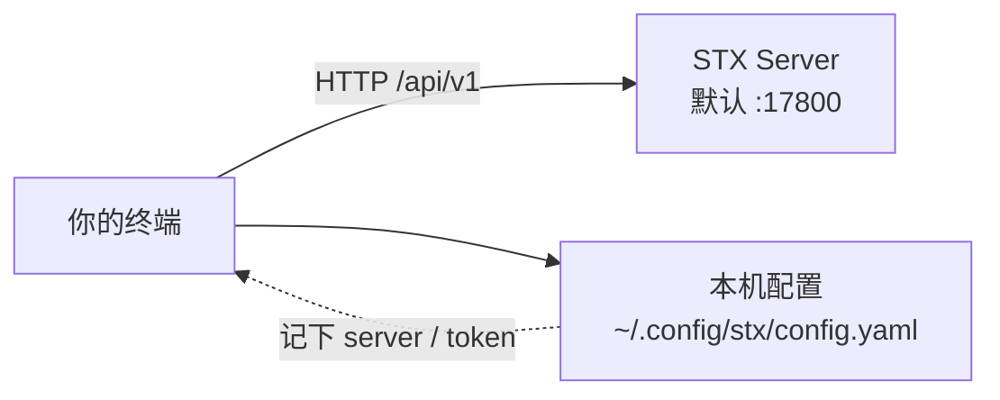

## 为什么原生做 CLI

现在已经进入 **AI Agent** 时代。大模型要和各个系统打通，目前最顺的范式就是 **CLI**：模型生成、执行、根据输出再决策，比直接操浏览器或裸调一堆 HTTP 接口省事得多。

所以 STX 把命令行做成一等公民，而不是 Web UI 的附属：

| 使用方 | 为什么需要 CLI |
| :--- | :--- |
| **人** | 脚本化、批量、CI / 流水线里可重复执行 |
| **AI Agent** | 用自然语言落到 `stx …` 命令，即可完成主机、集群、配置等运维动作 |

Web UI 擅长可视化与引导；CLI 擅长被人和模型稳定调用。两者共用同一套 STX Server。  
模型也可能下错令——所以 CLI 调用必须**进审计、可回放**，见下文「审计日志」。

`stx` 既是安装机上的服务入口（如 `stx api`），也是连远端 STX Server 的命令行客户端。下文说的「CLI」指后者。

## 它怎么工作



1. 用 `stx login` 登录某台 STX 安装机的 API（默认端口 **17800**）。
2. 登录成功后，本机记下该环境的地址与令牌（见下方「命名空间」）。
3. 之后的 `stx host …`、`stx cluster …` 等命令，都是带着令牌去调同一套 HTTP API；需要动被纳管主机时，仍由 Server 经 stx-agent 下发。

CLI 只跟 **STX Server** 说话；要动被纳管主机上的 SeaTunnel，仍由 Server 经 **stx-agent**（边上的探针进程）下发，命令行不会绕过这层。

## 登录与命名空间

本地配置默认路径：

- `$XDG_CONFIG_HOME/stx/config.yaml`，或
- `~/.config/stx/config.yaml`

一个配置文件里可以有多个 **命名空间**（namespace）：每个对应一套「Server 地址 + 登录态」，方便在测试 / 生产之间切换。

```bash
# 登录（会提示用户名密码；也可用参数 / 环境变量）
stx login --server http://10.0.0.10:17800

# 看当前身份
stx whoami

# 列出 / 切换本地命名空间
stx namespace list
stx namespace use <name>

stx logout
```

### 举例

| 场景 | 做法 |
| :--- | :--- |
| 只管一台 STX | `stx login --server http://10.0.0.10:17800`，之后直接敲业务命令 |
| 同时管测试与生产 | 分别 login 到不同 `--server`，用 `stx namespace use …` 切换 |
| 临时指定环境 | 命令上加 `--namespace`，或设环境变量 `STX_SERVER` / `STX_NAMESPACE` |

常用环境变量：`STX_SERVER`、`STX_NAMESPACE`、`STX_TOKEN`、`STX_TIMEOUT`（默认请求超时 **30s**）、`STX_OUTPUT`、`STX_USERNAME`。

## 读操作与写操作

操作在服务端登记了风险等级。对 CLI 的直观影响：

| 等级 | 典型含义 | CLI 行为 |
| :--- | :--- | :--- |
| **R0** | 查询、预检等只读或低影响 | 直接执行，**不需要** `--confirm` |
| **R1+** | 创建、更新、启停、安装等会改状态 | 必须加 `--confirm`，否则拒绝执行 |
| 更高风险（如部分删除 / 重启类） | 影响面更大 | 仍要 `--confirm`；个别操作服务端还会要求二次确认（见下） |

写操作还可带：

- `--idempotency-key`：同一请求重试时保持幂等（不传则 CLI 自动生成）
- `--confirmation-id`：服务端返回「需要二次确认」时，用返回的 ID 再执行一次

```bash
# 只读：列主机
stx host list

# 写入：必须确认
stx host create --name node-1 --ip-address 10.0.0.21 --confirm
stx cluster create --name demo --deployment-mode hybrid --version 2.3.13 --confirm
stx cluster restart 6 --confirm
```

## 命令从哪里来

| 类型 | 说明 | 例子 |
| :--- | :--- | :--- |
| **登记生成** | 多数 API 在操作登记表里声明后，自动生成同名 CLI | `stx cluster start`、`stx host list` |
| **手写增强** | 请求体复杂或流程特殊的，单独实现 | `stx cluster create`、`stx host install …`、同步任务相关命令 |
| **本机命令** | 不访问远端，只管本地配置 | `stx namespace …` |
| **服务进程** | 在 STX 安装机上起服务 | `stx api` / `stx server` |

业务命令大致按域分组，与 Web UI 能力对应，例如：`host`、`cluster`、`package`、`plugin`、`config`、`monitor`、`diagnostics`、`sync` 等。具体子命令以 `stx <域> --help` 为准。

## 输出格式

全局参数（根命令）：

| 参数 | 说明 |
| :--- | :--- |
| `--output` / `-f` | `json`（默认）、`table`、`yaml`、`raw` |
| `--pick` | 只保留结果里指定的顶层字段（逗号分隔） |

适合人眼浏览用 `table`；给脚本解析用默认 `json`。

```bash
stx host list --output table
stx whoami --pick username,roles
```

## 和 Web UI、AI Agent 的关系

| | Web UI | CLI |
| :--- | :--- | :--- |
| 入口 | 浏览器 → 安装机 **17880** | 终端 / AI Agent → 安装机 API **17800** |
| 适合 | 可视化、引导安装、看拓扑与进度 | 脚本、批量、CI；以及模型通过命令行操控 STX |
| 鉴权 | 浏览器会话 | `login` 写入本地命名空间的 token |
| 写保护 | 界面上的确认框 | `--confirm`（及必要时的二次确认） |

人和 AI Agent 走同一套命令与确认规则，避免「模型专用另一套接口」。Skill / 智能运维入口也按「会调 `stx`」来设计，而不是去模拟点击页面。

## 审计日志

专门为 CLI（尤其是 AI Agent 调用）做了审计侧优化：**每一次** `stx` 远端调用都要有迹可循。模型可能误停集群、误改配置；没有清晰的来源与请求编号，事后很难查清「是谁、哪一次调用」导致的问题。

Web UI 的审计列表里，「来源」会标成 **CLI** / **Web** / **系统**，一眼能分出是命令行还是页面发起的：


### 调用时带上什么

CLI 访问 STX Server 时会自动带上：

| 标记 | 作用 |
| :--- | :--- |
| **`X-STX-Client: cli`** | 标明来源是命令行（不是 Web UI） |
| **`X-Request-ID`** | 本次调用的请求编号；同一次操作里下发给 stx-agent 的命令共用这个编号，方便串起来查 |

写操作还会带上确认 / 幂等相关头（见上文 `--confirm`）。敏感参数入库前会脱敏，审计里不应出现密码原文。

### 两类记录怎么用

| 记录 | 看什么 | 常用查询 |
| :--- | :--- | :--- |
| **审计日志** | 谁（用户）、用哪种客户端、对什么资源做了什么、结果如何 | `stx audit list --client_type cli` |
| **命令日志** | STX Server 实际下发给 stx-agent 的命令及执行状态 | `stx audit command list --request_id <id>` |

排查「AI / 脚本刚执行过什么」时，典型路径：

1. `stx audit list --client_type cli --size 50`（必要时加 `--result_status failed`、时间范围）
2. 从条目里取出 `request_id`
3. `stx audit get <审计条目 id>` 看详情；再用同一 `request_id` 查 `stx audit command list`，看边上探针实际执行是否成功

Web UI 的「审计日志」页同样可按客户端类型等条件筛选；CLI 与页面查的是同一批数据。

```bash
# 只看命令行来源的操作
stx audit list --client_type cli --size 50 --output table

# 某次请求牵出的 Agent 侧命令
stx audit command list --request_id <request_id> --output table
```

## 最小上手路径

```bash
# 1. 能访问 STX API
curl -sS http://10.0.0.10:17800/api/v1/health

# 2. 登录
stx login --server http://10.0.0.10:17800 --username admin

# 3. 只读探路
stx whoami
stx host list --output table

# 4. 再做写入（务必 --confirm）
stx cluster create --name demo --deployment-mode hybrid --version 2.3.13 --confirm
```

主机 / 集群具体操作见 [主机管理](../host-cluster/host-management) 与 [集群管理](../host-cluster/cluster-management)；整体进程与端口见 [系统架构](./overview)。
