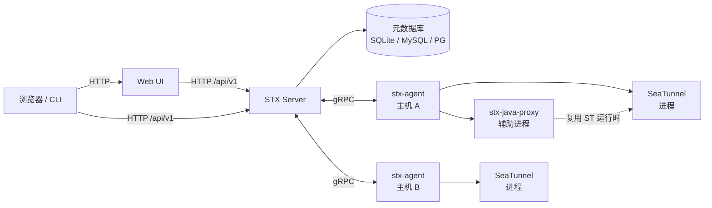
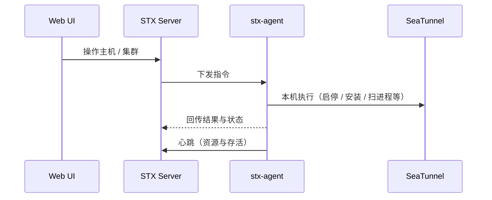

STX 是 Apache SeaTunnel 的运维平台。先分清两类机器：

| 角色 | 是什么 | 上面跑什么 |
| :--- | :--- | :--- |
| **STX 安装机** | 你一键安装 / 部署 STX 的那台（或那套）机器 | STX Server、Web UI、元数据库 |
| **被纳管主机** | Web UI「主机管理」里登记的机器，用来跑 SeaTunnel | `stx-agent`，以及 SeaTunnel / `stx-java-proxy` |

Web UI 与元数据在 STX 安装机一侧；对 SeaTunnel 的操作由被纳管主机上的 Agent 执行并上报。

### 举例

假设机房里有 3 台机器：

| 机器 | IP | 角色 |
| :--- | :--- | :--- |
| `stx-ops` | `10.0.0.10` | **STX 安装机**：执行一键安装，浏览器打开 `http://10.0.0.10:17880` |
| `data-1` | `10.0.0.21` | **被纳管主机**：在 Web UI 登记后装 Agent，再跑 SeaTunnel Master |
| `data-2` | `10.0.0.22` | **被纳管主机**：同样装 Agent，跑 SeaTunnel Worker |

你平时登录的是 `10.0.0.10` 的 Web UI；点「启动集群」时，指令从 `10.0.0.10` 经 gRPC 发到 `10.0.0.21` / `10.0.0.22` 上的 Agent，由它们在本机拉起 SeaTunnel。

网络上也按这个理解：

- `data-1` / `data-2` 要能访问 `10.0.0.10:17800`、`17890`（装 Agent、注册、收指令）
- `10.0.0.10` 要能访问各被纳管主机上的 `18080`（`stx-java-proxy`，可改）

小规模体验时，也可以 **三台合成一台**：同一台机器既装 STX，又登记为自己、再装 Agent 跑 SeaTunnel——角色仍是上面两套，只是落在同一台物理机上。

## 整体结构

浏览器与 CLI 访问 STX Server；对被纳管主机的操作由 Agent 经 gRPC 执行。需要调用 SeaTunnel Java 能力时，由**同一台被纳管主机**上的 `stx-java-proxy` 完成。

## 进程与职责

| 进程 | 怎么起 | 职责 |
| :--- | :--- | :--- |
| **STX Server（`stx api`）** | 一键安装后随服务启动 | HTTP API、鉴权、元数据；同时提供 Agent 所需的 gRPC 服务 |
| **Web UI** | 一键安装后随服务启动 | 网页界面（主机、集群、安装包、插件、监控等） |
| **stx-agent** | 在被纳管主机上执行安装命令 | 注册与心跳；预检、安装、启停、配置推送、进程发现等 |
| **stx-java-proxy** | 由平台在节点上托管启停 | 独立 Java 辅助进程，复用已安装的 SeaTunnel 运行时做配置解析与存储探测等 |
| **元数据库** | SQLite（默认）或 MySQL / PostgreSQL | 主机、集群、节点、配置版本、审计等 |

监控可对接 Prometheus / Grafana / Alertmanager：一键安装可附带本地三件套，也支持接入已有监控栈（需改配置）。

## stx-java-proxy

`stx-java-proxy` 跑在已安装 SeaTunnel 的节点上，作为独立进程复用引擎运行时能力，**不嵌进** Master / Worker 进程。默认监听 **18080**（安装或启动参数可改）。

主要能力包括：配置级 DAG 解析、Catalog 元数据探测、Checkpoint / IMAP 存储探测、source / transform 预览。默认堆内存上限约 **512MB**。

Web UI 可在集群维度查看其状态、日志，并执行启停 / 重启；安装与运行时探测会优先使用该服务。STX Server 要通过 Agent（或可达的 proxy 地址）访问节点上的 **18080**，网络需打通。

分工可以简单记：**Agent 管主机与进程编排；proxy 负责需要 SeaTunnel Java 能力的解析与探测。**

## 默认端口

| 端口 | 用途 |
| :--- | :--- |
| **17880** | Web UI |
| **17800** | STX Server HTTP API（含 Agent 安装脚本等） |
| **17890** | Agent gRPC |
| **18080** | 节点上 `stx-java-proxy`（可改） |

被纳管主机要能访问 STX 安装机上的 **17800** 与 **17890**（拉 Agent、注册、收指令）；STX Server 也要能访问被纳管主机上的 **18080**（经 Agent 探测 / 调用 `stx-java-proxy`）。

### `app.external_url` 怎么填

`config.yaml` 里的 `app.external_url` 会写进 Agent 安装命令（类似 `curl http://…:17800/api/v1/agent/install.sh | bash`）。  
命令是在**被纳管主机**上执行的，所以这里的地址必须是那台机器也能访问到的 STX API，一般是 STX 安装机的局域网 IP + **17800**。

接上例：

| `app.external_url` | `data-1` 执行安装命令时实际访问 | 结果 |
| :--- | :--- | :--- |
| `http://10.0.0.10:17800` | STX 安装机 | 正确 |
| `http://127.0.0.1:17800` | `data-1` 自己 | 装不上 / 连不上 |

你本机浏览器打开 Web UI 用的是 `http://10.0.0.10:17880`；`external_url` 管的是 **Agent 怎么找到 STX API（17800）**，不是 Web UI 地址。

## 能力分层

| 能力 | 说明 |
| :--- | :--- |
| **主机与 Agent** | 登记主机、安装 Agent、心跳与容量 |
| **集群与安装** | 集群定义、进程发现、一键安装与节点启停 |
| **配置 / 插件 / 安装包** | 配置版本与推送、连接器、SeaTunnel 安装包 |
| **监控与诊断** | 监控配置、事件与诊断入口 |
| **认证与审计** | 登录、用户管理、审计日志 |

## Agent 协作

Agent 接入后会：

1. **注册**：向 STX Server 报到，可携带预绑定的主机 ID 与本机地址
2. **心跳**：默认约 **10s** 一次；超过约 **30s** 未上报则判离线
3. **执行指令**：STX Server 下发预检、安装、启停、配置更新、进程发现等，Agent 回传结果
4. **日志与诊断**：按需上报日志，并配合诊断采集

主机与集群操作见 [主机管理](../host-cluster/host-management) 与 [集群管理](../host-cluster/cluster-management)。作业配置与调试见 [调试工作台](../workbench/overview)。命令行如何登录、确认写操作见 [CLI 设计](./cli)。

## 部署形态

| 形态 | 说明 |
| :--- | :--- |
| **Linux 一键安装** | 推荐路径；systemd 拉起 STX Server 与 Web UI |
| **Docker / Compose** | 适合快速体验或容器化部署 |
| **本地开发启动** | 分别启动 API 与 Web UI 进程 |

说明：用 Docker 跑 **STX 安装机上的组件**，与把 Docker / Kubernetes 当作 **被纳管主机环境** 不是一回事；后者当前版本尚未适配。
