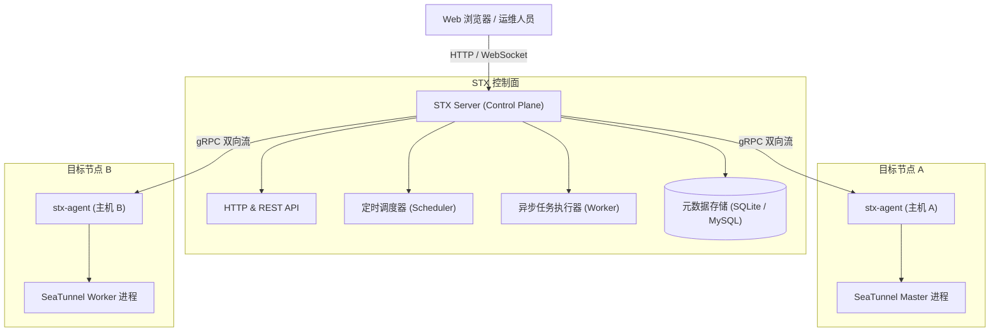

本文介绍 STX 的核心架构组成、进程角色以及数据交互流程。

## 整体架构

STX 采用 **控制面（Control Plane）** 与 **边缘探针（Agent）** 分离的架构设计：

---

## 核心组件分工

| 组件名称 | 运行位置 | 核心职责 |
| :--- | :--- | :--- |
| **STX Server (API)** | 中心控制机 | 响应前端管理请求、提供 REST 接口、执行用户鉴权与集群元数据操作 |
| **Scheduler** | 中心控制机 | 负责定时任务触发，如集群节点定期心跳探测、指标拉取、配置状态检查 |
| **Worker** | 中心控制机 | 异步消费耗时任务，例如安装包分发、多节点并发升级、大文件同步 |
| **stx-agent** | 被纳管目标节点 | 运行在集群机器上的轻量探针，负责执行命令、上报 SeaTunnel 进程状态与日志 |

---

## 关键交互流程

### 1. 探针心跳与保活
* `stx-agent` 启动后主动通过 gRPC（默认 `9090` 端口）向服务端发起长连接。
* 每隔 5 秒发送一次心跳数据包，上报目标节点的 CPU、内存水位以及 SeaTunnel 进程 PID。
* 当服务端超过 3 次未收到心跳时，自动将主机状态标记为 `Offline` 并触发通知。

### 2. 配置修改与推送
* 用户在 Web 端编辑 `seatunnel.yaml` 或连接器配置。
* 服务端创建新的配置版本，保留旧版本供回滚对比。
* 用户点击「推送到集群」后，服务端通过 gRPC 将最新配置文件流式下发至各节点的对应目录，并执行热重载命令。
