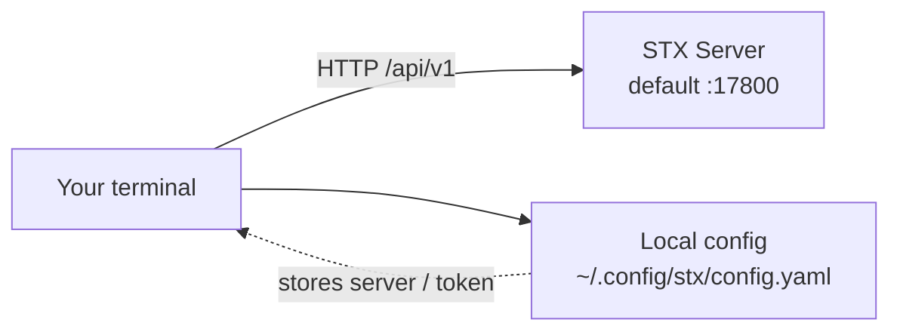

The STX client and server share the same binary: run `stx server` to start the service; run `stx login`, `stx cluster list`, and similar commands to operate a remote STX instance. You can copy this file to another Linux machine with the same architecture and use only its CLI capabilities—you do not need to log in to the STX install machine. This is similar to using the `hadoop` command after deploying Hadoop. Operations that must run on managed hosts are still dispatched by STX Server through `stx-agent`.

## Try a few commands

Assume STX Server is at `10.0.0.10`. On a machine with the CLI installed, run:

```bash
stx login --server http://10.0.0.10:17800
stx whoami
stx cluster list --output table
stx sync job list --status FAILED --output table
```

`login` prompts for a username and password. Query commands do not change the remote environment. After you see a failed job ID, use `stx sync job logs <job-id> --lines 40` to view logs; run `stx sync job logs --help` for available flags. STX CLI does not diagnose failures for you—a person or AI Agent can continue troubleshooting from the output.

To let an AI Agent call `stx`, run `stx skill install` on your machine (see [Install Skill for AI Agents](#install-skill-for-ai-agents)). **The Skill is local command documentation, not another service.**

Haven't installed the CLI yet? See [Install STX CLI](../get-started/quick-start#install-stx-cli) in the quick deploy guide and follow the steps for your layout (same machine as STX Server or separate).

## Client and server

The default STX Server API address is `http://10.0.0.10:17800` (sample IP). When using the CLI on the same machine, you can also connect to `http://127.0.0.1:17800`. After login, use read-only commands to inspect the environment first; write operations require explicit confirmation.

:::note
`stx server` starts STX Server. Copying `stx` to another machine and running `stx login`, `stx host …`, and similar commands does not start the service.
:::

## How it works



1. Use `stx login` to sign in to an STX install machine API (default port **17800**).
2. After a successful login, your machine stores that environment's address and token (see **Namespaces** below).
3. Subsequent commands such as `stx host …` and `stx cluster …` call the same HTTP API with that token. When managed hosts must be touched, STX Server still dispatches through `stx-agent`.

The CLI talks only to **STX Server**. To change SeaTunnel on managed hosts, STX Server still goes through **stx-agent** (the probe process on each host)—the CLI does not bypass that layer.

## Login and namespaces

Default local config path:

- `$XDG_CONFIG_HOME/stx/config.yaml`, or
- `~/.config/stx/config.yaml`

One config file can hold multiple **namespaces**: each maps to a **Server address + login state**, so you can switch between test and production.

```bash
# Login (prompts for username/password; flags and env vars also work)
stx login --server http://10.0.0.10:17800

# Show current identity
stx whoami

# List / switch local namespaces
stx namespace list
stx namespace use <name>

stx logout
```

### Examples

| Scenario | Approach |
| :--- | :--- |
| One STX environment | `stx login --server http://10.0.0.10:17800`, then run business commands |
| Test and production | Log in to different `--server` values, switch with `stx namespace use …` |
| One-off environment | Add `--namespace` on a command, or set `STX_SERVER` / `STX_NAMESPACE` |

Common environment variables: `STX_SERVER`, `STX_NAMESPACE`, `STX_TOKEN`, `STX_TIMEOUT` (default request timeout **30s**), `STX_OUTPUT`, `STX_USERNAME`.

## Command risk model

Operations are registered on the server with a risk level. What that means for the CLI:

| Level | Typical meaning | CLI behavior |
| :--- | :--- | :--- |
| **R0** | Queries, pre-checks, and other read-only or low-impact actions | Runs immediately; **no** `--confirm` required |
| **R1+** | Create, update, start/stop, install, and other state-changing actions | Requires `--confirm`; otherwise rejected |
| Higher risk (some delete / restart operations) | Broader impact | Still requires `--confirm`; some operations also need server-side re-confirmation (below) |

Write operations can also take:

- `--idempotency-key`: keep retries idempotent (CLI generates one if omitted)
- `--confirmation-id`: when the server returns "needs re-confirmation", pass the returned ID on the next run

```bash
# Read-only: list hosts
stx host list

# Write: confirmation required
stx host create --name node-1 --ip-address 10.0.0.21 --confirm
stx cluster create --name demo --deployment-mode hybrid --version 2.3.13 --confirm
stx cluster restart 6 --confirm
```

## Output formats

Global flags (root command):

| Flag | Description |
| :--- | :--- |
| `--output` / `-f` | `json` (default), `table`, `yaml`, `raw` |
| `--pick` | Keep only the listed top-level fields in the result (comma-separated) |

Use `table` for human browsing; use default `json` for scripts.

```bash
stx host list --output table
stx whoami --pick username,roles
```

## Web UI, CLI, and AI Agents

| | Web UI | CLI |
| :--- | :--- | :--- |
| Entry | Browser → install machine **17880** | Terminal / AI Agent → install machine API **17800** |
| Best for | Visual workflows, guided install, topology and progress | Scripts, batch jobs, CI; models driving STX via commands |
| Auth | Browser session | Token from `login` stored in a local namespace |
| Write protection | Confirmation dialogs in the UI | `--confirm` (and re-confirmation when required) |

People and AI Agents follow the same commands and confirmation rules. AI Agents call `stx` through the local Skill—they do not simulate clicking the Web UI.

## Install Skill for AI Agents

On the same user account that runs the AI Agent, install local documentation files (does not contact the server; you still need `stx login` before querying or changing the environment):

```bash
stx skill install
stx skill status --output table
```

| `--target` | Path |
| :--- | :--- |
| `claude` | `~/.claude/skills/stx/SKILL.md` |
| `agents` | `~/.agents/skills/stx/SKILL.md` |
| `all` (default) | Writes to both |

`install` does not overwrite existing files; after upgrading the CLI, run `stx skill update`. Language follows your locale by default; use `--language zh-CN` or `en`.

## Audit logs

Audit logging is optimized for CLI use (especially AI Agent calls): **every** remote `stx` invocation should be traceable. A model might stop a cluster or change config by mistake; without a clear source and request ID, it is hard to tell who—or which call—caused a problem later.

In the Web UI audit list, **Source** shows **CLI** / **Web** / **System**, so you can tell command-line from page-initiated actions at a glance:


### What each call sends

When the CLI accesses STX Server, it automatically includes:

| Header | Purpose |
| :--- | :--- |
| **`X-STX-Client: cli`** | Marks the source as the command line (not Web UI) |
| **`X-Request-ID`** | Request ID for this invocation; commands dispatched to `stx-agent` in the same operation share this ID for end-to-end tracing |

Write operations also send confirmation / idempotency headers (see `--confirm` above). Sensitive parameters are redacted before storage—passwords should not appear in audit records.

### Two record types

| Record | What it shows | Typical query |
| :--- | :--- | :--- |
| **Audit log** | Who (user), which client, what resource, what action, outcome | `stx audit list --client_type cli` |
| **Command log** | Commands STX Server actually sent to `stx-agent` and their status | `stx audit command list --request_id <id>` |

Details include **execution and command trace**: for one operation (e.g. `diagnostics.task.create`), which commands the local `stx-agent` actually ran—such as `get_logs`, `thread_dump` (including `jcmd … Thread.print`)—so you can verify the AI or script issued the right instructions.


Typical path when investigating "what did the AI / script just run?":

1. `stx audit list --client_type cli --size 50` (add `--result_status failed` or a time range if needed)
2. Take `request_id` from an entry
3. `stx audit get <audit-entry-id>` for details; then `stx audit command list` with the same `request_id` to see whether the probe executed successfully

The Web UI **Audit log** page filters on the same data (including client type). CLI and Web UI query the same records.

```bash
# CLI-sourced operations only
stx audit list --client_type cli --size 50 --output table

# stx-agent-side commands for one request
stx audit command list --request_id <request_id> --output table
```

## Minimal getting-started path

```bash
# 1. Reach STX API
curl -sS http://10.0.0.10:17800/api/v1/health

# 2. Login
stx login --server http://10.0.0.10:17800 --username admin

# 3. Read-only exploration
stx whoami
stx host list --output table

# 4. Writes (always use --confirm)
stx cluster create --name demo --deployment-mode hybrid --version 2.3.13 --confirm
```

For host and cluster operations, see [Host management](../host-cluster/host-management) and [Cluster management](../host-cluster/cluster-management). For process layout and ports, see [System architecture](./overview).
