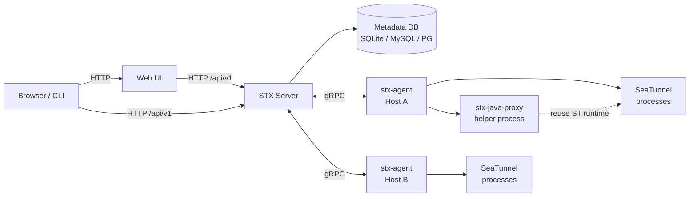
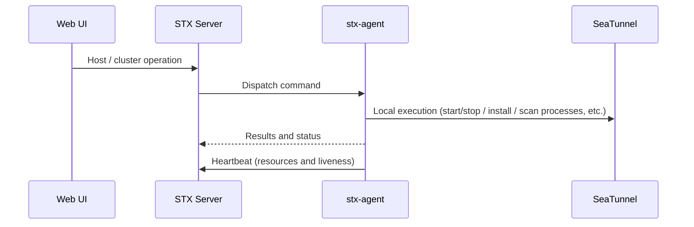

Start with where STX is installed, then where SeaTunnel runs. These roles can be on the same machine or on different machines.

| Role | What it is | What runs there |
| :--- | :--- | :--- |
| **STX install machine** | The machine (or stack) where you one-click install / deploy STX | STX Server, Web UI, metadata database |
| **Managed host** | A machine registered under Web UI **Host management**, used to run SeaTunnel | `stx-agent`, plus SeaTunnel / `stx-java-proxy` |

The Web UI and metadata live on the STX install machine; operations on SeaTunnel are executed and reported by `stx-agent` on managed hosts.

## A three-machine example

Assume three machines in a datacenter:

| Machine | IP | Role |
| :--- | :--- | :--- |
| `stx-ops` | `10.0.0.10` | **STX install machine**: one-click install; browser opens `http://10.0.0.10:17880` |
| `data-1` | `10.0.0.21` | **Managed host**: register in Web UI, install stx-agent, run SeaTunnel Master |
| `data-2` | `10.0.0.22` | **Managed host**: install stx-agent, run SeaTunnel Worker |

You usually sign in to the Web UI at `10.0.0.10`. When you click **Start cluster**, instructions go from `10.0.0.10` over gRPC to stx-agent on `10.0.0.21` / `10.0.0.22`, which start SeaTunnel locally.

Networking follows the same picture:

- `data-1` / `data-2` must reach `10.0.0.10:17800` and `17890` (install stx-agent, register, receive commands)
- `10.0.0.10` must reach **18080** on each managed host (`stx-java-proxy`; configurable)

For a small trial, you can **collapse all three onto one machine**: same box installs STX, registers itself, installs stx-agent, and runs SeaTunnel—the two roles above still apply, just on one physical host.

## Overall layout

Browser and CLI reach STX Server; operations on managed hosts run over gRPC through stx-agent. When SeaTunnel Java capabilities are needed, **the same managed host** runs `stx-java-proxy` to handle them.

## Processes and responsibilities

| Process | How it starts | Responsibility |
| :--- | :--- | :--- |
| **STX Server (`stx server`)** | Starts with the one-click install service | HTTP API, auth, metadata; also provides gRPC for Agents |
| **Web UI** | Starts with the one-click install service | Web interface (hosts, clusters, packages, plugins, monitoring, etc.) |
| **stx-agent** | Install command on the managed host | Registration and heartbeat; pre-checks, install, start/stop, config push, process discovery, etc. |
| **stx-java-proxy** | Managed start/stop on the node | Independent Java helper process; reuses installed SeaTunnel runtime for config parsing, storage probes, etc. |
| **Metadata database** | SQLite (default) or MySQL / PostgreSQL | Hosts, clusters, nodes, config versions, audit, etc. |

Monitoring can integrate with Prometheus / Grafana / Alertmanager: the one-click install may bundle a local trio, or you can point at an existing stack (config changes required).

## stx-java-proxy

`stx-java-proxy` runs on nodes where SeaTunnel is installed. It is a **separate process** that reuses the engine runtime—it is **not embedded** in Master / Worker. Default listen port **18080** (changeable at install or startup).

Main capabilities: config-level DAG parsing, Catalog metadata probes, Checkpoint / IMAP storage probes, source / transform preview. Default max heap about **512MB**.

The Web UI shows cluster-level status and logs and supports start / stop / restart. Install and runtime probes prefer this service. STX Server reaches **18080** on the node through stx-agent (or a reachable proxy address)—network must allow it.

Short division of labor: **stx-agent handles host and process orchestration; proxy handles parsing and probes that need SeaTunnel Java.**

## Default ports

| Port | Purpose |
| :--- | :--- |
| **17880** | Web UI |
| **17800** | STX Server HTTP API (includes stx-agent install scripts, etc.) |
| **17890** | stx-agent gRPC |
| **18080** | `stx-java-proxy` on the node (configurable) |

Managed hosts must reach **17800** and **17890** on the STX install machine (pull stx-agent, register, receive commands). STX Server must reach **18080** on managed hosts (probe / call `stx-java-proxy` via stx-agent).

### How to set `app.external_url`

`app.external_url` in `config.yaml` is embedded in stx-agent install commands (similar to `curl http://…:17800/api/v1/agent/install.sh | bash`).  
The command runs **on the managed host**, so the URL must be an STX API address that host can reach—usually the install machine's LAN IP plus **17800**.

Using the example above:

| `app.external_url` | What `data-1` hits when running install | Result |
| :--- | :--- | :--- |
| `http://10.0.0.10:17800` | STX install machine | Correct |
| `http://127.0.0.1:17800` | `data-1` itself | Install fails / cannot connect |

Your browser opens the Web UI at `http://10.0.0.10:17880`; `external_url` controls **how stx-agent finds the STX API (17800)**, not the Web UI address.

## Capability layers

| Layer | Description |
| :--- | :--- |
| **Hosts and stx-agent** | Register hosts, install stx-agent, heartbeat and capacity |
| **Clusters and install** | Cluster definitions, process discovery, one-click install, node start/stop |
| **Config / plugins / packages** | Config versions and push, connectors, SeaTunnel packages |
| **Monitoring and diagnostics** | Monitoring config, events, diagnostic entry points |
| **Auth and audit** | Sign-in, user management, audit logs |

## stx-agent collaboration

After stx-agent connects:

1. **Register**: reports to STX Server, optionally with a pre-bound host ID and local address
2. **Heartbeat**: about every **10s** by default; offline if no report for about **30s**
3. **Execute commands**: STX Server sends pre-checks, install, start/stop, config updates, process discovery, etc.; stx-agent returns results
4. **Logs and diagnostics**: upload logs on demand and support diagnostic collection

For host and cluster operations, see [Host management](../host-cluster/host-management) and [Cluster management](../host-cluster/cluster-management). For job config and debugging, see [Debug workbench](../workbench/overview). For CLI login and write confirmations, see [STX CLI](./cli).

## Deployment modes

| Mode | Description |
| :--- | :--- |
| **Linux one-click install** | Recommended path; systemd starts STX Server and Web UI |
| **Docker / Compose** | Quick trial or containerized deploy |
| **Local dev startup** | Start API and Web UI processes separately |

Note: running **STX install machine components** in Docker is not the same as using Docker / Kubernetes as the **managed host environment**—the latter is not supported in the current release.
